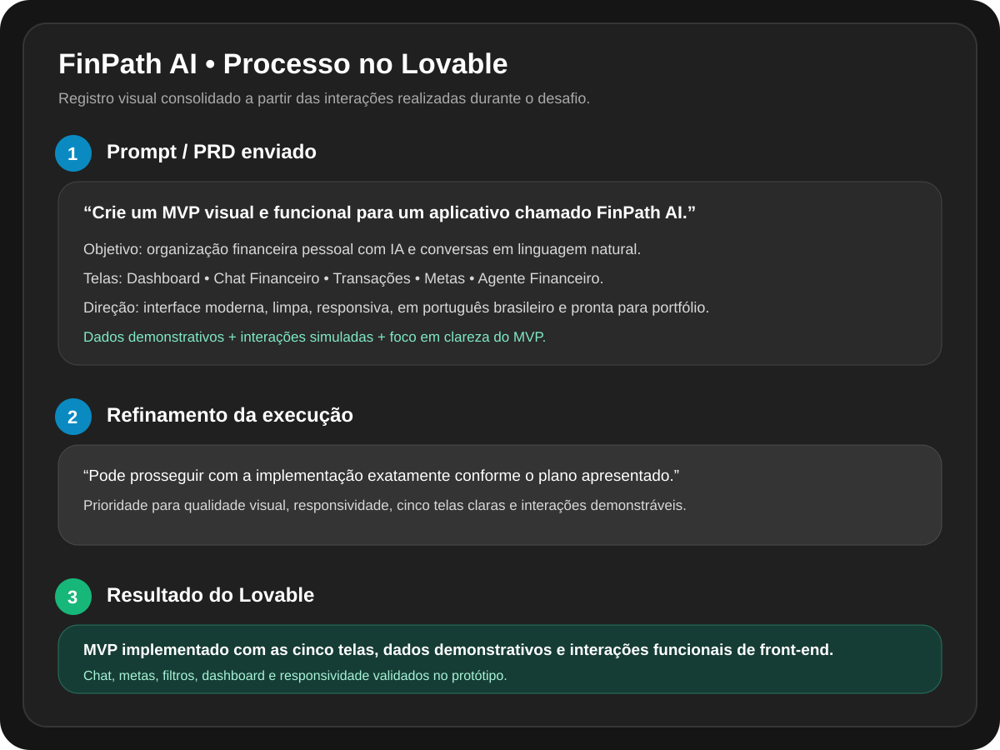

# 💸 FinPath AI

Aplicativo conceitual de **organização de finanças pessoais com Inteligência Artificial**, desenvolvido para o desafio **App de Organização de Finanças Pessoais com Vibe Coding**, da DIO.

> **Status:** ✅ MVP conceitual concluído no Lovable.

[▶️ Abrir prévia do MVP](https://id-preview--049c403d-79db-4c6f-8774-7ea9d6a64d92.lovable.app) · [🛠️ Projeto no Lovable](https://lovable.dev/projects/049c403d-79db-4c6f-8774-7ea9d6a64d92)


---

## 📌 Sobre o projeto

O **FinPath AI** foi criado para tornar o controle financeiro pessoal mais simples, principalmente para pessoas que estão começando a administrar o próprio dinheiro.

Em vez de depender de planilhas, formulários extensos ou registros manuais, o usuário pode conversar com o aplicativo em linguagem natural.

Exemplo:

> **Usuário:** “Gastei R$ 45 no mercado hoje.”

A IA interpreta a mensagem, identifica valor, categoria, data e tipo da transação e solicita confirmação antes do registro.

Também é possível criar metas naturalmente:

> **Usuário:** “Quero juntar R$ 3.000 em seis meses.”

O aplicativo calcula uma estimativa mensal, acompanha o progresso e apresenta orientações simples com base nos dados cadastrados.

## 🎯 Problema

Muitas pessoas abandonam aplicativos de controle financeiro porque precisam registrar manualmente cada gasto, selecionar categorias, atualizar informações e interpretar relatórios pouco intuitivos.

Além disso, apenas mostrar quanto foi gasto nem sempre ajuda o usuário a entender **o que fazer com aquela informação**.

## 💡 Solução proposta

O FinPath AI combina uma experiência conversacional com recursos de organização financeira para:

- registrar receitas e despesas por chat;
- classificar transações automaticamente;
- acompanhar metas financeiras;
- apresentar um dashboard simples;
- identificar padrões de gastos;
- oferecer orientações educativas por meio de um Agente Financeiro com IA.

## 👥 Público-alvo

O foco principal são jovens e adultos que estão começando a organizar suas finanças, incluindo:

- estudantes;
- pessoas no primeiro emprego;
- profissionais com renda variável;
- usuários que consideram planilhas e aplicativos financeiros tradicionais complexos ou trabalhosos.

---

## 🚀 Funcionalidades principais do MVP

### 1. Dashboard financeiro
Apresenta saldo atual, receitas, despesas, economia do mês, categorias de gastos, evolução do saldo, metas e um insight do agente.

### 2. Chat Financeiro
Permite registrar informações usando linguagem natural, com interpretação e confirmação visual antes do registro.

### 3. Histórico de Transações
Exibe descrição, categoria, data, tipo, valor e filtros de receitas e despesas.

### 4. Metas Financeiras
Permite acompanhar objetivos, valor-alvo, valor acumulado, prazo, progresso e estimativa mensal necessária.

### 5. Agente Financeiro
Apresenta análises simples, educativas e não julgadoras com base nos dados demonstrativos do usuário.

---

# 🧠 Prompt final / PRD utilizado no Lovable

<details>
<summary><strong>Clique para visualizar o prompt completo</strong></summary>

```text
Crie um MVP visual e funcional para um aplicativo chamado FinPath AI.

OBJETIVO DO PROJETO
O FinPath AI é um aplicativo de organização de finanças pessoais com inteligência artificial, pensado principalmente para jovens e adultos que estão começando a administrar o próprio dinheiro. O diferencial é permitir que o usuário controle suas finanças por meio de conversas em linguagem natural, reduzindo a necessidade de formulários, planilhas e categorização manual.

PROBLEMA
Muitas pessoas abandonam aplicativos financeiros porque precisam registrar manualmente cada gasto, escolher categorias, atualizar valores e interpretar relatórios complexos. Além disso, apenas mostrar quanto foi gasto não ajuda necessariamente o usuário a entender o que fazer com essa informação.

PÚBLICO-ALVO
- estudantes;
- jovens no primeiro emprego;
- adultos começando a organizar as finanças;
- profissionais com renda variável;
- pessoas que acham planilhas e apps financeiros tradicionais trabalhosos.

PROPOSTA DE VALOR
Permitir que o usuário organize suas finanças da mesma maneira que conversaria com alguém.

Exemplo:
Usuário: "Gastei R$ 45 no mercado hoje."
O sistema deve interpretar automaticamente:
- tipo: despesa;
- valor: R$ 45;
- categoria: alimentação/mercado;
- data: hoje;
e pedir confirmação antes de registrar.

Outro exemplo:
Usuário: "Quero juntar R$ 3.000 em seis meses."
O sistema deve criar uma meta, calcular quanto deve ser reservado por mês e acompanhar o progresso.

FUNCIONALIDADES PRINCIPAIS DO MVP

1. DASHBOARD
Exibir de forma clara:
- saldo atual;
- receitas do mês;
- despesas do mês;
- economia no mês;
- principais categorias de gastos;
- gráfico simples de evolução;
- progresso das metas;
- um pequeno insight gerado pelo Agente Financeiro.

2. CHAT FINANCEIRO
Interface de conversa em linguagem natural.
Deve aceitar mensagens como:
- "Gastei R$ 28 no almoço hoje."
- "Recebi R$ 800 do estágio."
- "Paguei R$ 120 de internet."
- "Quero economizar R$ 2.000 até janeiro."

Após interpretar a mensagem, mostrar uma confirmação visual dos dados detectados antes do registro.

3. HISTÓRICO DE TRANSAÇÕES
Lista organizada com:
- descrição;
- categoria;
- data;
- valor;
- tipo de transação;
- filtros básicos.

Categorias sugeridas:
alimentação, transporte, educação, lazer, moradia, compras, saúde e renda.

4. METAS FINANCEIRAS
Permitir criar e visualizar metas com:
- nome;
- valor alvo;
- valor acumulado;
- prazo;
- percentual de progresso;
- estimativa mensal necessária.

5. AGENTE FINANCEIRO
Uma área com análises simples e educativas baseadas nos dados do usuário.

Exemplos:
- "Seus gastos com alimentação fora de casa aumentaram neste mês."
- "Mantendo o ritmo atual, você pode alcançar sua meta dentro do prazo."
- "Você gastou mais com transporte nesta semana do que na anterior."

O agente deve ser amigável, objetivo, não julgador e nunca apresentar recomendações financeiras como garantias.

FLUXO PRINCIPAL
Dashboard → Chat Financeiro → interpretação da IA → confirmação do usuário → registro → atualização do Dashboard → metas e análises → Agente Financeiro.

DESIGN
Quero uma interface:
- moderna;
- limpa;
- intuitiva;
- com aparência profissional;
- voltada para jovens sem parecer infantil;
- responsiva e mobile-first;
- com bom uso de cards e hierarquia visual;
- com ícones simples;
- sem excesso de elementos.

Use uma identidade visual que transmita confiança, tecnologia e organização financeira. Evite estética genérica de banco tradicional. Prefira uma experiência leve de produto SaaS moderno.

DADOS DEMONSTRATIVOS
Preencha a interface com dados fictícios coerentes para que o MVP pareça utilizável logo ao abrir. Exemplo:
- saldo: R$ 1.842,50;
- receitas do mês: R$ 2.300;
- despesas do mês: R$ 1.457,50;
- meta: Notebook novo, R$ 3.000, progresso de aproximadamente 42%.

INTERAÇÃO
Mesmo que o backend real não esteja implementado, crie interações demonstráveis no front-end:
- navegação entre as telas;
- simulação de envio de mensagem no chat;
- confirmação de uma transação;
- criação ou visualização de meta;
- visualização de insights.

ENTREGÁVEL
Crie o MVP com as telas:
1. Dashboard;
2. Chat Financeiro;
3. Transações;
4. Metas;
5. Agente Financeiro.

Priorize uma experiência que fique visualmente interessante em screenshots para portfólio e que comunique claramente o conceito do produto.

Todo o conteúdo da interface deve estar em português brasileiro.
```

</details>

### Refinamento enviado após o plano inicial

> “Pode prosseguir com a implementação exatamente conforme o plano apresentado. Priorize qualidade visual, responsividade, clareza das cinco telas e interações demonstráveis para portfólio. Todo o conteúdo deve permanecer em português brasileiro.”

---

## 🔄 Fluxo conceitual

```text
Dashboard
   ↓
Chat Financeiro
   ↓
Interpretação da IA
   ↓
Confirmação do usuário
   ↓
Registro da transação
   ↓
Atualização do Dashboard
   ↓
Metas e análises
   ↓
Agente Financeiro
```

## 🤖 Exemplo de interação

**Usuário**

> Gastei R$ 28 no almoço hoje.

**FinPath AI**

> Identifiquei uma despesa de R$ 28 em Alimentação para hoje. Deseja confirmar?

**Usuário**

> Sim.

**FinPath AI**

> Registrado. Seus gastos com alimentação neste mês foram atualizados no painel.

---

## 🖼️ Evidências do processo com IA

### Processo de criação no Lovable

O registro abaixo consolida as capturas feitas durante o envio do PRD, o refinamento e a conclusão da implementação.



### Resultado do MVP

O Lovable gerou o protótipo com **Dashboard, Chat Financeiro, Transações, Metas e Agente Financeiro**, além de dados demonstrativos e interações de front-end.


> As demais telas e interações podem ser exploradas na [prévia do FinPath AI](https://id-preview--049c403d-79db-4c6f-8774-7ea9d6a64d92.lovable.app).

---

## 🧪 Plano de validação

O MVP pode ser testado com um pequeno grupo de usuários observando:

- rapidez para registrar uma despesa;
- precisão percebida da classificação automática;
- facilidade de compreensão do dashboard;
- facilidade para criar uma meta;
- utilidade percebida das análises da IA;
- preferência entre registro por conversa e formulários tradicionais.

A pergunta central da validação é: **controlar as finanças por conversa é mais simples e natural do que usar formulários tradicionais?**

---

## 📝 Reflexão sobre o processo

O principal aprendizado deste desafio foi perceber que a qualidade do resultado da IA depende diretamente da clareza das instruções fornecidas.

No início, a ideia poderia ser resumida simplesmente como “criar um aplicativo financeiro com IA”. Porém, transformar essa intenção em um PRD estruturado tornou a execução muito mais previsível. Definir o problema, o público-alvo, as funcionalidades, os exemplos de uso, o comportamento do agente, o fluxo das telas e a direção visual reduziu bastante a ambiguidade para a ferramenta.

O que funcionou melhor foi justamente esse detalhamento. O Lovable conseguiu transformar o briefing em um MVP com as cinco áreas previstas, mantendo uma identidade visual coerente e dados demonstrativos suficientes para representar uma experiência real de produto.

Também ficou claro que Vibe Coding não significa apenas escrever uma frase e aceitar qualquer resultado produzido. Houve uma etapa de planejamento, seguida de uma instrução de refinamento para preservar qualidade visual, responsividade e clareza das telas. A IA acelerou a construção, mas ainda foi necessário avaliar se o resultado correspondia à intenção original.

O processo mostrou, portanto, que trabalhar bem com IA envolve **definir contexto, estabelecer restrições, avaliar o resultado e iterar**. O valor não está apenas em gerar rapidamente, mas em saber orientar a ferramenta para transformar uma ideia em algo coerente e apresentável.

---

## 🛠️ Ferramentas e conceitos utilizados

- Lovable;
- ChatGPT;
- GitHub;
- Inteligência Artificial generativa;
- Vibe Coding;
- MVP (Produto Mínimo Viável);
- PRD (Product Requirements Document);
- prototipação e validação de produto.

---

## ✅ Checklist do desafio

- [x] Fork do repositório-base;
- [x] Definição do conceito do aplicativo;
- [x] Criação do PRD;
- [x] Definição das funcionalidades principais;
- [x] Definição do fluxo conceitual;
- [x] Execução do PRD em uma ferramenta de IA;
- [x] Refinamento do MVP por meio de nova interação;
- [x] Registro das interações com a IA;
- [x] Geração do MVP visual;
- [x] Reflexão final;
- [x] Revisão do README;
- [x] Entrega do link público do repositório na plataforma da DIO.

---

## 🎓 Sobre o desafio

Projeto desenvolvido para o desafio **App de Organização de Finanças Pessoais com Vibe Coding**, da DIO, com foco em utilizar IA como parceira no processo de ideação, especificação, prototipação e refinamento de um produto digital.
